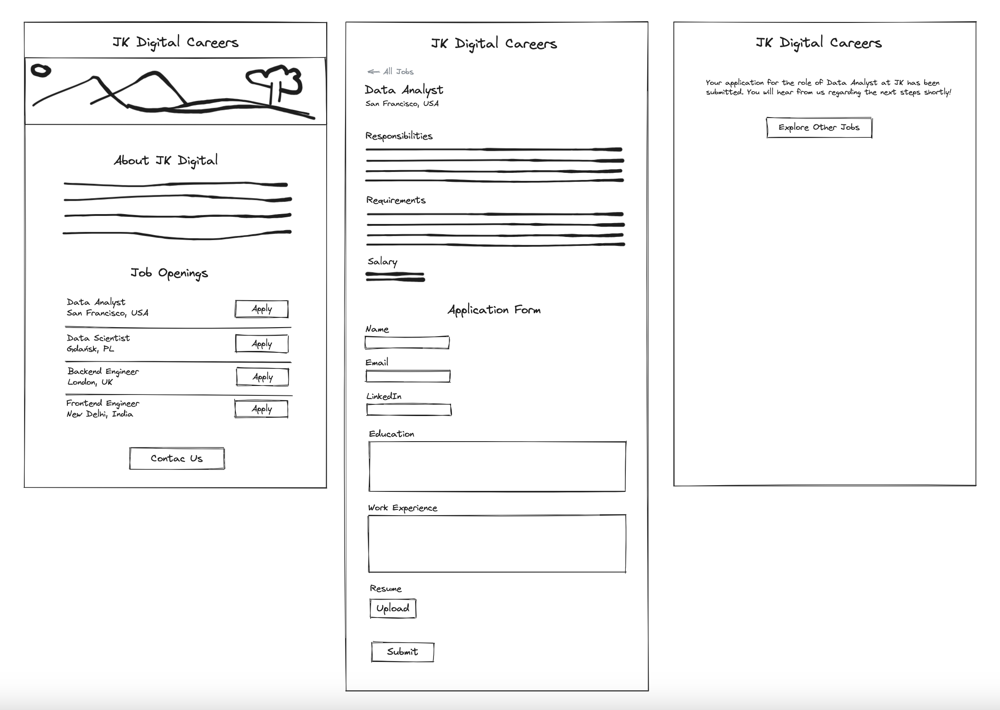

# JK Digital Careers  📟

This version (v2) includes **MySQL Database** connection on the backend

**Live Preview: [Click Me](https://jk-digital-careers-website-v2.onrender.com/)**

---

**A Web Development Project with Python, Flask & Dynamic Database-Driven Web Apps**. Made as a practice project. The idea was taken from web development community  

## What I learned:

### Flask:
- Basics of Flask
### Bootstrap:
- Styling with Bootstrap framework
- Adding a Navbar and Footer from Bootstrap
### Jinja:
- Inserting Dynamic Data into HTML templates
- Rendering Dynamic Data using Jinja template tags
- Looping through the list of dictionaries to present the data in HTML
- Handling logic of condition if some info is not present in the list of dictionaries
- Creating templates that could be rendered on other templates
### API:
- Adding API Route to Return JSON instead of HTML
### Cloud:
- Deploying website to the cloud Render.com
- Setting up a cloud **MySQL** database on PlanetScale.com
- Managing sensitive connection credentials as environment variables with a Secret File (.env) and python-dotenv library for safe deployment
- Managing SSL Certificates for safe connection to database
### Mailto:
- Adding mailto: links for the buttons 'Apply' and 'Contact Us'
- Constructing email templates and converting them to URLs
### SQL:
- Setting up a cloud **MySQL** database on PlanetScale.com
- Basics of MySQL Workbench:  
    Connecting MySQL Workbench to database on PlanetScale.com  
    Creating tables and inserting data using both SQL queries and direct inserts  
- Connecting Web App to database hosted on cloud using **SQLAlchemy** library in Python
- Retrieving data from a database and converting it to a list of dictionary objects
- Inserting data into database using submission form in HTML
- Incorporating database queries into the code with dynamically bound parameters linked to the dynamic parts of URL routes
- Managing sensitive connection credentials as environment variables with a Secret File (.env) and python-dotenv library for safe deployment
- Managing SSL Certificates for safe connection to a database

## Tools Used:

1. Code Editor: VSCode
2. Drawing Wireframes - [https://excalidraw.com/](https://excalidraw.com/)
3. Images - [https://unsplash.com/](https://unsplash.com/)
4. Styling framework - [https://getboostrap.com/](https://getboostrap.com/)
5. Icons - [https://icons8.com/](https://icons8.com/)
6. Logo - [https://freelogodesign.org/](https://freelogodesign.org/)
7. Mailto: Link Generator - [https://mailtolink.me/](https://mailtolink.me/)
8. Cloud Deployment: 
    for Web Apps - [https://render.com/](https://render.com/) 
    for MySQL - [https://planetscale.com/](https://planetscale.com/) 
